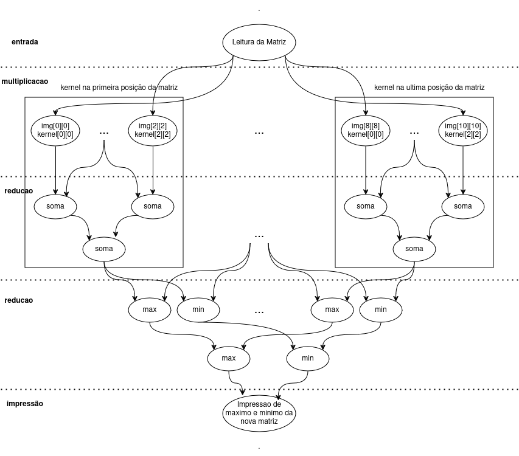

# Convolução
Implementação da operação de Convolução utilizando OMP

## Metodologia PCAM
A metodologia PCAM para desenvolvimento de código paralelo foi aplicada para obter um código com maior velocidade e é realizada em quatro etapas.

### Particionamento

É realizado um particionamento por dados. Após a leitura dos dados, são criados blocos de tarefas, em que cada bloco possui tarefas relativas a uma posição da matriz. Cada tarefa diz respeito a multiplicação de um elemento do kernel por seu respectivo (na mesma posição) elemento da matriz. Em seguida, haverão novas tarefas, com o objetivo de somar os resultados de cada bloco a fim de encontrar o valor da posição correspondente a este na nova matriz. Por fim, calculou-se o maior e o menor elemento concorrentemente por meio da operação de redução sob toda a nova matriz, valores que serão impressos. Todo o processo descrito pode ser visualizado com ajuda do grafo de dependências acima.

### Comunicação
O grafo de comunicação de dados é semelhante ao grafo de dependências da etapa de Particionamento. Na etapa de multiplicação a comunicação é mínima, já que cada submatriz pode ser processada independentemente. Há uma redundância de dados ao longo dos blocos, com a repetição de dados de posições vizinhas. Na fase de unificação/soma dos valores de multiplicação de cada elemento da nova matriz, há necessidade de reunir os resultados individuais através da redução. Há uma segunda operação de redução para encontrar o maior e menor valor da nova matriz. Ambos processos requerem comunicação entre pares de tarefas de mesmo nível da árvore, para consolidar resultados de cada posição da matriz. Por fim, os dados obtidos durante a última etapa são encaminhados para uma nova matriz e então impressos.

### Aglomeração
Aqui, considera-se uma plataforma MIMD com memória compartilhada, com um número restrito de elementos de processamento. Nesta aglomeração a granularidade aumenta para dar mais peso a cada tarefa, diminuindo a comunicação e redundância de dados. São criados tantas threads quanto elementos de processamento disponíveis na plataforma (relação de 1:1). Durante a multiplicação, associamos um ou mais bloco de tarefas a cada thread, respeitando a localidade, isto é, cada thread irá receber blocos relativos a posições próximas na matriz, de forma a minimizar a redundância de dados na cache. Em seguida, a unificação de cada bloco através da soma é realizado, de forma que cada thread faça o processamento relativo aos blocos adquiridos na etapa anterior. Por fim, são criadas tarefas referentes à segunda etapa de redução, que serão associadas às threads de forma dinâmica. A thread responsável pela leitura e impressão das matrizes pode ajudar no processamento e fica responsável também por fatias da carga de trabalho.

### Mapeamento
O mapeamento é dinâmico. Levando em consideração que o algoritmo será executado em uma máquina MIMD de memória compartilhada, haverá uma distribuição de tarefas onde cada processador será responsável por um submatriz da matriz de imagem, aplicando o filtro a essas regiões. O trabalho é distribuído de maneira que cada processador aplique a convolução em uma parte da imagem, e o número de submatrizes (tamanho do bloco) atribuídas a cada processador deve ser balanceado para evitar sobrecarga de alguns processadores.

## Conclusão
É fácil perceber a intuição da implementação de computação paralela no problema de convolução em matrizes. Nesse sentido, a metodologia PCAM oferece uma forma fácil e direta de realizar o planejamento do código paralelo antes de implementar. O código submetido na plataforma Run Codes obteve desempenho considerável e um Speed Up quando comparado com a versão sequencial. Assim, concluímos esse relatório sublinhando a importância da aplicação da metodologia PCAM para o projeto de códigos de alto desempenho buscando aumento de eficiência e speedup.
